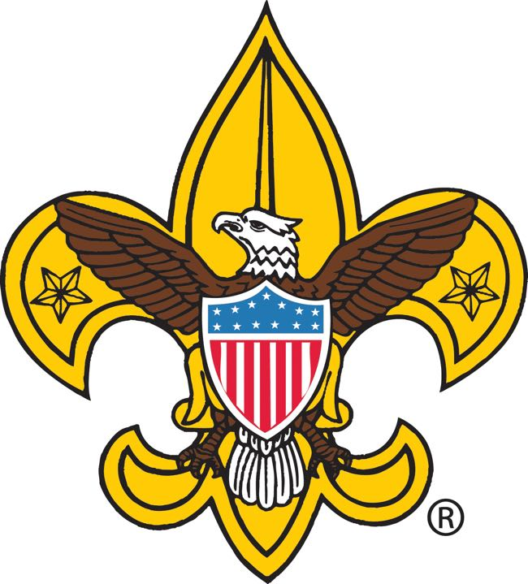

# AI Embroidery Mockup Generator

[](https://github.com/ryanmcarden/ai-embroidery-mockup-generator/actions/workflows/tests.yml)

An applied AI pipeline that analyzes customer logo artwork, estimates embroidery production complexity, and generates embroidery-style mockups for review.

This project was built around a real custom embroidery workflow: before a logo can be quoted, digitized, or sewn, the artwork often needs to be reviewed for text size, stitch complexity, gradients, color count, thin lines, and placement suitability.

The goal of this project is to demonstrate how multimodal AI, image generation, Python automation, and domain-specific business rules can be combined into a practical workflow tool.

---

## Example: Customer Artwork to Embroidery Mockup

The system takes a flat customer-uploaded logo and generates an embroidery-style visual mockup.

| Customer Uploaded Artwork                                  | Generated Embroidery Mockup                                     |
| ---------------------------------------------------------- | --------------------------------------------------------------- |
|  |  |
|       |       |

The second example demonstrates the pipeline on a high-complexity logo with fine feather detail, layered fills, and multiple color regions — the type of artwork where the suitability scoring and complexity routing matter most. The ® mark was removed from the source artwork as it would not survive at embroidery scale.

The customer artwork is analyzed for embroidery suitability before mockup generation. The system reviews the image for layout, text, color count, gradients, stroke thickness, and production risk.

---

## Background

This project came out of real work at [Stitch America](https://stitchamerica.com), a custom embroidery and apparel company. The production version of this workflow runs in n8n and is used to triage incoming customer artwork before it reaches a digitizer. Before this system existed, every logo submission required manual review to catch issues that could affect production — small text, gradients, thin strokes, oversized complexity for the requested placement.

This repository is a standalone Python port of that n8n workflow, built to demonstrate the AI engineering patterns in a form that's easier to review and run independently.

The project reflects my broader hands-on experience building production AI systems: integrating multimodal models, designing structured outputs for downstream automation, and applying domain-specific rules to make model output actually useful in a business context. The stack I work in day-to-day includes n8n, the OpenAI and Claude APIs, Python, and cloud infrastructure on Cloudflare and Azure.

---

## What This Project Demonstrates

This is not just an image-generation demo. The project is designed to show an applied AI workflow that connects model output to a real business process.

The pipeline demonstrates:

* Multimodal image analysis using GPT-4o-mini
* Structured JSON output for downstream automation
* Embroidery-specific production heuristics
* Placement-aware stitch estimation
* Risk detection for small text, gradients, thin strokes, and high-detail artwork
* Optional image simplification for complex logos
* Embroidery-style mockup generation
* A Python CLI workflow that could be connected to quoting, customer service, CRM, or n8n automation systems

---

## Why This Matters

In embroidery, a logo that looks good on screen may not sew well.

Common production issues include:

* Text that is too small to embroider clearly
* Gradients that need to be converted into solid thread colors
* Thin lines that may disappear when stitched
* Complex artwork that needs simplification
* Designs that are too detailed for small placements like left chest or hat front
* Logos that require human review before quoting or digitizing

This project gives a fast first-pass review of a logo before a human digitizer or production expert makes the final call.

The system is not intended to replace a digitizer. It is intended to reduce repetitive review work and help sales, quoting, and customer service teams move faster.

---

## How It Works

Input: a customer logo image.

The system:

1. Loads the image and calculates approximate source dimensions.
2. Uses GPT-4o-mini vision to analyze the logo.
3. Detects artwork features that affect embroidery production.
4. Recommends an embroidery size based on placement.
5. Estimates stitch count using placement-aware logic.
6. Flags risks such as small text, gradients, thin strokes, or high visual complexity.
7. Optionally simplifies complex artwork before mockup generation.
8. Generates an embroidery-style mockup.
9. Saves the mockup and optional structured analysis output.

---

## Pipeline Architecture

```text
Customer logo image
   |
   v
Image dimension analysis
   |
   v
GPT-4o-mini logo analysis
   |
   |-- text detection
   |-- icon detection
   |-- color count
   |-- layout type
   |-- gradients
   |-- stroke thickness
   |-- visual complexity
   |
   v
Embroidery suitability scoring
   |
   v
Placement-aware sizing and stitch estimate
   |
   v
Complexity routing
   |
   |-- simple artwork  -> use original artwork
   |-- complex artwork -> PIL color quantization (flat fills, no gradients)
   |
   v
Embroidery-style mockup generation
   |
   v
Mockup image + structured analysis JSON
```

---

## Example Image Analysis Output

Below is an example of the structured analysis produced from a customer logo image before mockup generation.

```json
{
  "logo_description": {
    "contains_text": true,
    "contains_icon": true,
    "detected_text": "SHELL",
    "text_lines": ["SHELL"],
    "essential_text": ["SHELL"],
    "nonessential_text": [],
    "icon_description": "A stylized shell shape segmented with rays and colors.",
    "layout_type": "badge",
    "visual_complexity": "medium",
    "color_count_estimate": 3,
    "gradient_detected": false,
    "stroke_thickness": "medium"
  },
  "placement_context": {
    "raw_placement_input": "unknown",
    "normalized_placement": "other"
  },
  "source_art_context": {
    "source_width_in": 14.22,
    "source_height_in": 13.19,
    "aspect_ratio": 1.0779,
    "source_size_is_not_final_embroidery_size": true
  },
  "recommended_embroidery_size": {
    "recommended_width_in": 4.0,
    "recommended_height_in": 3.68,
    "sizing_reason": "The logo has a badge-style layout and can be sized conservatively to maintain legibility.",
    "sizing_confidence": 0.9
  },
  "text_readability_analysis": {
    "minimum_readable_text_height_in": 0.2,
    "text_is_likely_readable": true,
    "readability_notes": "The primary SHELL text is large and simple enough for embroidery at the recommended size."
  },
  "embroidery_risk_analysis": {
    "suitability_score": 8,
    "risk_level": "low",
    "risk_flags": [],
    "production_notes": [
      "Simple color count.",
      "No gradients detected.",
      "Medium stroke thickness should translate well to embroidery."
    ]
  },
  "stitch_estimate": {
    "estimated_stitches": 8420,
    "production_estimate": 9683,
    "confidence": 0.82,
    "estimate_notes": "Badge-style logo with moderate fill area and simple color separation."
  },
  "recommendation": {
    "summary": "This logo is a good candidate for embroidery.",
    "suggested_changes": [
      "Confirm final placement before production.",
      "Review very small internal details if used below 4 inches wide."
    ],
    "human_review_required": true
  }
}
```

A full example output can be saved in:

```text
examples/shell-analysis.json
```

---

## Tech Stack

| Component     | Purpose                                                        |
| ------------- | -------------------------------------------------------------- |
| Python        | Pipeline orchestration                                         |
| GPT-4o-mini   | Logo analysis and structured suitability scoring               |
| GPT-Image-1   | Embroidery-style mockup generation                             |
| Pillow        | Image loading, dimension analysis, and color simplification    |
| python-dotenv | Local environment variable handling                            |

---

## Repository Structure

```text
ai-embroidery-mockup-generator/
│
├── embroidery_mockup.py
├── requirements.txt
├── env.example
├── README.md
│
├── examples/
│   ├── shell-source.png
│   ├── shell-mockup.png
│   └── shell-analysis.json
│
└── output/
    └── generated mockups and analysis files
```

---

## Running Tests

The test suite covers all deterministic logic — stitch estimation, placement routing, dimension resolution, and color simplification. No API keys required.

```bash
pip install pytest
pytest tests/ -v
```

---

## Setup

Clone the repository:

```bash
git clone https://github.com/ryanmcarden/ai-embroidery-mockup-generator.git
cd ai-embroidery-mockup-generator
```

Install dependencies:

```bash
pip install -r requirements.txt
```

Create a local environment file:

```bash
cp env.example .env
```

Add your API key:

```env
OPENAI_API_KEY=your-openai-api-key
```

---

## Usage

Run the full analysis and mockup pipeline:

```bash
python embroidery_mockup.py --image examples/shell-source.png --placement "left chest"
```

Run analysis only without generating a mockup:

```bash
python embroidery_mockup.py --image examples/shell-source.png --placement "hat front" --analyze-only
```

Save structured analysis output:

```bash
python embroidery_mockup.py --image examples/shell-source.png \
  --placement "left chest" \
  --save-analysis examples/shell-analysis.json \
  --output examples/shell-mockup.png
```

Skip the optional simplification step:

```bash
python embroidery_mockup.py --image examples/shell-source.png \
  --placement "left chest" \
  --no-simplify
```

Specify a different placement:

```bash
python embroidery_mockup.py --image examples/shell-source.png \
  --placement "full back" \
  --output output/full-back-mockup.png
```

---

## Supported Placements

The stitch estimate and recommended sizing logic are placement-aware.

Current placement examples include:

* Left chest
* Hat front
* Full back
* Sleeve
* Other general placements

Each placement has different practical constraints. For example, a full-back design can support more detail than a hat-front design, while left-chest embroidery usually requires stronger simplification and better small-text handling.

---

## Example Use Cases

This type of system could support:

* Customer service teams reviewing uploaded logos
* Sales teams preparing faster quote estimates
* Internal production teams triaging artwork
* Automated pre-checks before digitizing
* Customer-facing preview workflows
* n8n or CRM-based quoting automation
* AI-assisted artwork review queues

---

## Current Status

This is a portfolio/prototype version of the system.

It demonstrates the core AI workflow and orchestration pattern, but it is not yet packaged as a production SaaS application.

Current capabilities include:

* Logo image analysis
* Structured embroidery suitability scoring
* Placement-aware size recommendation
* Stitch count estimation
* Risk flagging
* Mockup generation
* CLI-based execution
* 32 unit tests covering all deterministic logic (run offline, no API keys needed)

Planned improvements include:
* Add more example input/output pairs
* Add benchmark results comparing estimated stitch counts to actual stitch counts
* Add a small API endpoint
* Add a simple web UI
* Add CI checks
* Add Docker support
* Improve error handling around failed API calls
* Add an optional n8n workflow export

---

## Evaluation

The `eval/` directory contains a benchmark of the stitch estimator against 18 synthetic completed jobs, covering 7 placement types and 3 complexity levels.

Run it with:

```bash
python eval/eval.py
```

### Results (18 jobs)

| Metric | Value |
| ------ | ----- |
| MAE    | 1,631 stitches |
| MAPE   | 12.9% |
| Over-estimates | 7 jobs |
| Under-estimates | 11 jobs |

**By complexity:**

| Complexity | Jobs | MAE | MAPE |
| ---------- | ---- | --- | ---- |
| low    | 6 | 650   | 17.4% |
| medium | 7 | 756   |  8.5% |
| high   | 5 | 4,033 | 13.9% |

**By placement:**

| Placement   | Jobs | MAE   | MAPE  |
| ----------- | ---- | ----- | ----- |
| sleeve      | 2    | 480   | 10.8% |
| hat front   | 3    | 687   | 15.5% |
| hat side    | 2    | 774   | 18.1% |
| left chest  | 5    | 971   | 13.0% |
| right chest | 2    | 1,308 | 13.9% |
| full back   | 3    | 4,729 |  9.2% |

### Key Findings

**Medium complexity logos are the most accurately estimated (8.5% MAPE).** The heuristic was calibrated for this range and the MIN_STITCHES floor does not interfere.

**The MIN_STITCHES floor is the largest source of error for small, simple designs.** The 6 jobs where the estimator hit the floor had a 17.4% MAPE versus 10.7% for the remaining 12. For small monograms and minimal hat branding, the floor can inflate estimates by 20–30%.

**High complexity logos are systematically underestimated (13.9% MAPE).** Dense fills, fine linework, and layered stitch regions add more stitches than the area-based formula captures. Complex logos should be reviewed with the suitability score before quoting.

---

## What This Shows as an AI Engineering Project

This project demonstrates practical AI engineering skills, including:

* Turning a real business bottleneck into an AI-assisted workflow
* Combining LLM vision, image generation, and deterministic production rules
* Designing structured model outputs for automation
* Applying domain knowledge to model orchestration
* Building tools that support human decision-making
* Connecting AI capabilities to measurable business operations

---

## Limitations

This system is a first-pass review tool, not a replacement for a professional digitizer.

Limitations include:

* Stitch estimates are approximate
* Mockups are visual previews, not production stitch files
* Human review is still needed for final approval
* Complex logos may require manual cleanup
* Small text and fine detail can still fail in real embroidery
* Output quality depends on the source artwork and selected placement

---

## License

MIT
